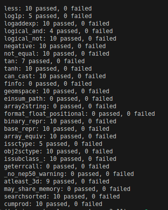

# Synthetic (Numpy) Code Generator

This a combination of proof-of-concept scripts where I set out to generate synthetic data that could potentially be used to train a machine learning model. Code could be a good source of data because the success of the artificial generation could be verified and measured with some objective performance metrics (like runtime or memory use). Here's how the project works:

1. Read a Python library (I chose `numpy`) and extract its functions and their code. (`generate_inputs.py`)
1. Use OpenAI's chat completion API to read that code and generate some potential input to the function. (`generate_inputs.py`)
1. Execute those inputs via Docker and capture the output (including any errors it might spit out). (`generate_inputs.py`)
1. Call the OpenAI API again to generate a "better version" of the original function code and save that. (`generate_rewrites.py` and `clean_rewrites.py`)
1. Execute the new code with the previously generated inputs to ensure that the outputs are the same as the original code. (`test_rewrites.py`)

## Results
It's certainly possible! Here's a screenshot of the final tests of some rewritten code:



Here's an example of some artificially rewritten code:
```python

    def array_equiv(a1, a2):
        """
        Returns True if input arrays are shape consistent and all elements equal.

        Shape consistent means they are either the same shape, or one input array
        can be broadcasted to create the same shape as the other one.

        Parameters
        ----------
        a1, a2 : array_like
            Input arrays.

        Returns
        -------
        out : bool
            True if equivalent, False otherwise.

        Examples
        --------
        >>> np.array_equiv([1, 2], [1, 2])
        True
        >>> np.array_equiv([1, 2], [1, 3])
        False

        Showing the shape equivalence:

        >>> np.array_equiv([1, 2], [[1, 2], [1, 2]])
        True
        >>> np.array_equiv([1, 2], [[1, 2, 1, 2], [1, 2, 1, 2]])
        False

        >>> np.array_equiv([1, 2], [[1, 2], [1, 3]])
        False

        """
        import numpy as np  # import numpy

        # Try to convert the inputs to numpy arrays
        try:
            input_array1, input_array2 = np.asarray(a1), np.asarray(a2)
        except ValueError:  # Specifically handle ValueError exceptions
            return False

        # Check if the arrays are shape consistent
        if input_array1.shape != input_array2.shape:  # Compare the shapes directly
            return False

        # Check if all elements are equal
        return np.array_equal(input_array1, input_array2)  # Use numpy's array_equal instead of == operator
```

## Next Steps:
Some cool things could be done in a future version of these scripts:
* Use the `numpy` documentation to generate more realistic inputs to the functions
* Build the Dockerfile to accept more than just `numpy` as an input package
* Test different code generation prompts to do more invasive changes to each function
* Benchmark the runtime of the original code and the rewritten code to see if there's a performance or memory improvement
* Detect unit tests and use those to evaluate the success of the artificial code as well